# Portl — Entity Relationship Diagram

Generated from `packages/database/prisma/schema.prisma` (Phase 1). Enum-typed
fields show the enum name; see the schema file for the full value lists.

```mermaid
erDiagram
    Society ||--o{ Tower : "has"
    Society ||--o{ User : "has members"
    Society ||--o{ GuardProfile : "employs"
    Society ||--o{ AdminProfile : "managed by"
    Society ||--o{ PendingResidentInvite : "issues"
    Society ||--o{ Notice : "publishes"
    Society ||--o{ Poll : "runs"
    Society ||--o{ Amenity : "offers"
    Society ||--o{ ServiceProvider : "lists"

    Tower ||--o{ Flat : "contains"

    Flat ||--o{ ResidentProfile : "houses"
    Flat ||--o{ PendingResidentInvite : "invite target"
    Flat ||--o{ Visitor : "visited"
    Flat ||--o{ GuestPreApproval : "pre-approvals"
    Flat ||--o{ HelpdeskTicket : "tickets"
    Flat ||--o{ MaintenanceDue : "billed"

    User ||--o| ResidentProfile : "resident role"
    User ||--o| GuardProfile : "guard role"
    User ||--o| AdminProfile : "admin role"
    User ||--o{ RefreshToken : "sessions"
    User ||--o{ PushToken : "devices"
    User ||--o{ Notification : "receives"
    User ||--o{ Visitor : "registered (guard)"
    User |o--o{ Visitor : "approved (resident)"
    User |o--o{ HelpdeskTicket : "assigned to"
    User ||--o{ TicketComment : "authors"
    User ||--o{ Notice : "published by"
    User ||--o{ Poll : "created by"
    User ||--o{ PendingResidentInvite : "invited by"
    User ||--o{ ServiceProvider : "added by"

    ResidentProfile ||--o{ FamilyMember : "family"
    ResidentProfile ||--o{ Vehicle : "vehicles"
    ResidentProfile ||--o{ GuestPreApproval : "creates"
    ResidentProfile ||--o{ HelpdeskTicket : "raises"
    ResidentProfile ||--o{ PollVote : "votes"
    ResidentProfile ||--o{ AmenityBooking : "books"
    ResidentProfile ||--o{ Payment : "pays"

    HelpdeskTicket ||--o{ TicketComment : "comments"

    Poll ||--o{ PollOption : "options"
    Poll ||--o{ PollVote : "votes"
    PollOption ||--o{ PollVote : "chosen in"

    Amenity ||--o{ AmenityBooking : "bookings"

    MaintenanceDue ||--o{ Payment : "settled by"

    Society {
        string id PK
        string name
        string address
        string city
        string state
        string pincode
    }

    Tower {
        string id PK
        string societyId FK
        string name "unique per society"
    }

    Flat {
        string id PK
        string towerId FK
        string flatNumber "unique per tower"
        int floor
        FlatType type
    }

    User {
        string id PK
        string name
        string email "unique, nullable"
        string phone "unique, nullable"
        string passwordHash "null for Google-only"
        AuthProvider authProvider
        string googleId "unique, nullable"
        string avatarUrl
        Role role
        string societyId FK
        boolean isActive
        string emergencyContactName "nullable"
        string emergencyContactPhone "nullable"
    }

    ResidentProfile {
        string id PK
        string userId FK "unique"
        string flatId FK
        boolean isPrimaryResident
        datetime moveInDate
    }

    FamilyMember {
        string id PK
        string residentProfileId FK
        string name
        string relation
        int age
        string photoUrl
    }

    Vehicle {
        string id PK
        string residentProfileId FK
        string number
        VehicleType type
    }

    GuardProfile {
        string id PK
        string userId FK "unique"
        string societyId FK
        string gateAssigned
        string shiftStart "HH:mm"
        string shiftEnd "HH:mm"
    }

    AdminProfile {
        string id PK
        string userId FK "unique"
        string societyId FK
        string designation
    }

    RefreshToken {
        string id PK
        string userId FK
        string tokenHash "unique"
        datetime expiresAt
        datetime revokedAt "nullable"
    }

    PendingResidentInvite {
        string id PK
        string societyId FK
        string flatId FK
        string email "nullable"
        string phone "nullable"
        string invitedByAdminId FK
        InviteStatus status
        datetime claimedAt
    }

    Visitor {
        string id PK
        string name
        string phone
        string photoUrl
        VisitorPurpose purpose
        string vehicleNumber
        string flatId FK
        string registeredByGuardId FK
        VisitorStatus status
        string approvedByResidentId FK "nullable"
        datetime entryTime
        datetime exitTime
    }

    GuestPreApproval {
        string id PK
        string residentId FK
        string flatId FK
        string guestName
        string guestPhone
        datetime validFrom
        datetime validTo
        string vehicleNumber
        string qrCode "unique"
        PreApprovalStatus status
    }

    HelpdeskTicket {
        string id PK
        string residentId FK
        string flatId FK
        TicketCategory category
        string title
        string description
        string-array photoUrls
        TicketPriority priority
        TicketStatus status
        string assignedToId FK "nullable"
    }

    TicketComment {
        string id PK
        string ticketId FK
        string authorId FK
        string message
    }

    Notice {
        string id PK
        string societyId FK
        string title
        string body
        NoticeCategory category
        boolean isPinned
        string publishedByAdminId FK
        datetime scheduledAt "nullable"
    }

    Poll {
        string id PK
        string societyId FK
        string question
        boolean allowMultiple
        datetime deadline
        string createdByAdminId FK
    }

    PollOption {
        string id PK
        string pollId FK
        string text
    }

    PollVote {
        string id PK
        string pollId FK
        string optionId FK
        string residentId FK
    }

    Amenity {
        string id PK
        string societyId FK
        string name
        string description
        string-array photoUrls
        string rules
        decimal pricePerSlot "nullable"
        boolean isActive
    }

    AmenityBooking {
        string id PK
        string amenityId FK
        string residentId FK
        date date
        string startTime "HH:mm"
        string endTime "HH:mm"
        BookingStatus status
    }

    MaintenanceDue {
        string id PK
        string flatId FK
        int month
        int year
        decimal amount
        datetime dueDate
        DueStatus status
    }

    Payment {
        string id PK
        string dueId FK
        string residentId FK
        decimal amount
        PaymentMethod method
        string transactionId "unique, nullable"
        PaymentStatus status
        datetime paidAt
    }

    ServiceProvider {
        string id PK
        string societyId FK
        string name
        ServiceCategory category
        string phone
        string photoUrl
        boolean isVerified
        string addedByAdminId FK
    }

    PushToken {
        string id PK
        string userId FK
        string token "unique per user"
        DeviceType deviceType
    }

    Notification {
        string id PK
        string userId FK
        string title
        string body
        NotificationType type
        json data
        boolean isRead
    }
```

## Key constraints enforced in the service layer (not the DB)

- `User`: at least one of `email` / `phone` must be set at signup.
- `PendingResidentInvite`: at least one of `email` / `phone` must be set.
- `PollVote`: one vote per poll per resident when `Poll.allowMultiple = false`
  (the DB only prevents duplicate votes for the same option).
- `AmenityBooking`: slot-overlap prevention against existing bookings.
